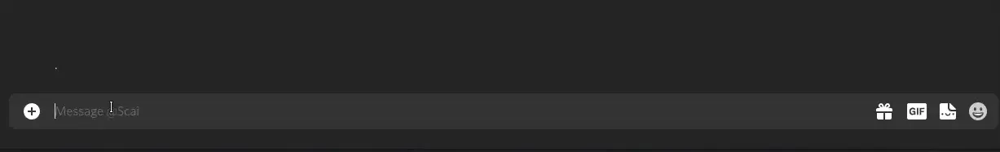

# Replugged Smart Edit Plugin

This plugin automagically edits your previous message when you send a message with an asterisk. To
understand this see the image below

I have infiltrated the readme heheheheh

